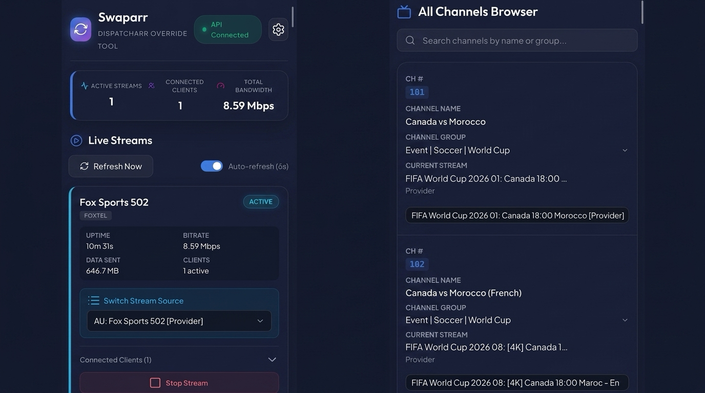

<div align="center">
  
  <h1>🔄 Swaparr</h1>
  <p><b>Dispatcharr Stream Override Tool</b></p>
</div>

<div align="center">

[](https://github.com/mckenna654/swaparr/actions)
[](https://github.com/mckenna654/swaparr/commits/main)
[](https://github.com/mckenna654/swaparr/pkgs/container/swaparr)

</div>

A beautiful, lightweight, and fully mobile-responsive web dashboard for **Dispatcharr** (middleware for managing IPTV streams, EPG, and proxy connections).

> **Note**: This application is proudly **"vibe coded"** 🌊✨ - designed with a focus on aesthetics, smooth interactions, and an intuitive feel over strict architectural rigidity. It was built using modern AI coding workflows to deliver a highly polished user experience rapidly.

Swaparr solves the challenge of managing and overriding streams from mobile web browsers by providing a clean, glassmorphic layout tailored for smaller touch screens.

<div align="center">
  
</div>

## Features

-   📺 **Active Stream Monitoring**: Displays channels currently being streamed, uptime, bandwidth, data transferred, and active client counts.
-   🔄 **Stream Source Dropdown**: Pick any configured backup stream for active channels from a mobile-friendly dropdown — no more cycling through sources one at a time.
-   ⏹️ **Stream Lifecycle Controls**: Stop active streams (terminate and release client slots) directly from your phone.
-   🔍 **Channels Browser**: Search all configured channels and pre-configure/override their stream sources even when they are offline.
-   👥 **Client Detail Inspector**: Expand any active channel card to see exactly who (IP, User-Agent, transfer speed) is watching.
-   ⚙️ **Server-Side Configuration**: Securely provide your API key via environment variables so you never have to re-type it on different devices.
-   📱 **Native App Experience**: Full PWA support for Android ("Install App") and iOS ("Add to Home Screen") for a beautiful, fullscreen standalone dashboard.
-   ⏰ **Auto-refresh Engine**: Real-time stats engine with configurable automatic polling.

## Prerequisites

Before running Swaparr, ensure you have:
1.  **Dispatcharr Server URL**: The IP and port where your Dispatcharr backend runs (e.g. `http://192.168.1.100:9191`).
2.  **API Key**: Copy your user API key from **Dispatcharr -> Settings -> Users -> API Key** (you can click *Regenerate API Key* if you do not have one).

## Quick Start

### Option 1: Docker (recommended for Unraid / self-hosting)

Pull and run the published image:

```bash
docker run -d \
  --name swaparr \
  --restart unless-stopped \
  -p 8080:8080 \
  -e DISPATCHARR_URL="http://192.168.1.100:9191" \
  -e DISPATCHARR_API_KEY="your_api_key_here" \
  -e NGINX_PORT="8080" \
  ghcr.io/mckenna654/swaparr:latest
```

*Note: The internal container port defaults to 8080, but can be changed via the `NGINX_PORT` environment variable if you need to run it behind gluetun or another network setup.*

Open **http://your-server-ip:8080** on your phone or browser.

#### Unraid

1. Go to **Docker → Add Container**
2. Set **Repository** to `ghcr.io/mckenna654/swaparr:latest`
3. Add a port mapping: `8080` (host) → `8080` (container)
4. Click **Add another Path, Port, Variable**:
   - **Config Type**: Variable
   - **Name**: Dispatcharr URL
   - **Key**: `DISPATCHARR_URL`
   - **Value**: `http://<your-dispatcharr-ip>:9191`
5. Click **Add another Path, Port, Variable** again:
   - **Config Type**: Variable
   - **Name**: API Key
   - **Key**: `DISPATCHARR_API_KEY`
   - **Value**: `<your-api-key>`
6. *(Optional)* If you need to change the internal port (e.g. for Gluetun), add another **Variable**:
   - **Key**: `NGINX_PORT`
   - **Value**: `8080`
7. Apply, then open `http://<unraid-ip>:8080`

### Option 2: Python (local development)

1.  **Set Environment Variables**:
    ```bash
    export DISPATCHARR_URL="http://192.168.1.100:9191"
    export DISPATCHARR_API_KEY="your_api_key_here"
    ```

2.  **Start the Server**:
    Run the lightweight Python server script on your host machine:
    ```bash
    python3 run_server.py
    ```

2.  **Connect from Mobile**:
    The console will print out the network addresses of your computer, for example:
    ```text
    ============================================================
     🔄  SWAPARR - MOBILE OVERRIDE SERVER IS RUNNING
    ============================================================

    Access the dashboard on this computer:
      👉  http://localhost:8080

    Access the dashboard on your MOBILE phone (same WiFi network):
      👉  http://192.168.1.50:8080
    ```
    Open the mobile address on your phone's web browser.

## How Override Works Internally

Swaparr sends requests directly to Dispatcharr's backend API endpoints:
-   `/proxy/ts/status` — Scans Redis metadata keys to retrieve current stream states.
-   `/proxy/ts/change_stream/<channel_uuid>` — Dynamically re-routes the stream thread to the selected `stream_id` (IPTV playlist link) without interrupting client connections.
-   `/proxy/ts/stop/<channel_uuid>` — Disconnects the clients and stops active streaming buffers to prevent provider ban/over-use.

## Styling & Theme

Swaparr uses high-performance, modern native web styling:
-   **Typography**: *Outfit* for headers, *Plus Jakarta Sans* for body copy.
-   **Theme**: Deep futuristic navy-blue background with glowing cyan, purple, and pink accents.
-   **Responsiveness**: Uses mobile-first layouts that automatically scale up beautifully to tablets and desktop monitors.

## Docker Image

Published automatically to GitHub Container Registry on every push to `main`:

```
ghcr.io/mckenna654/swaparr:latest
```

Tagged releases are also published when you create a `v*` git tag (e.g. `v1.0.0`).
